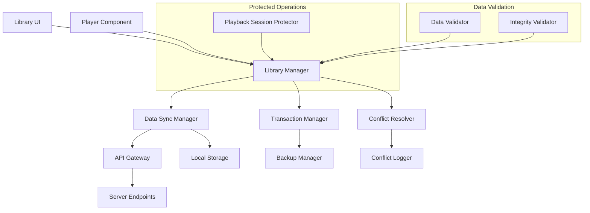
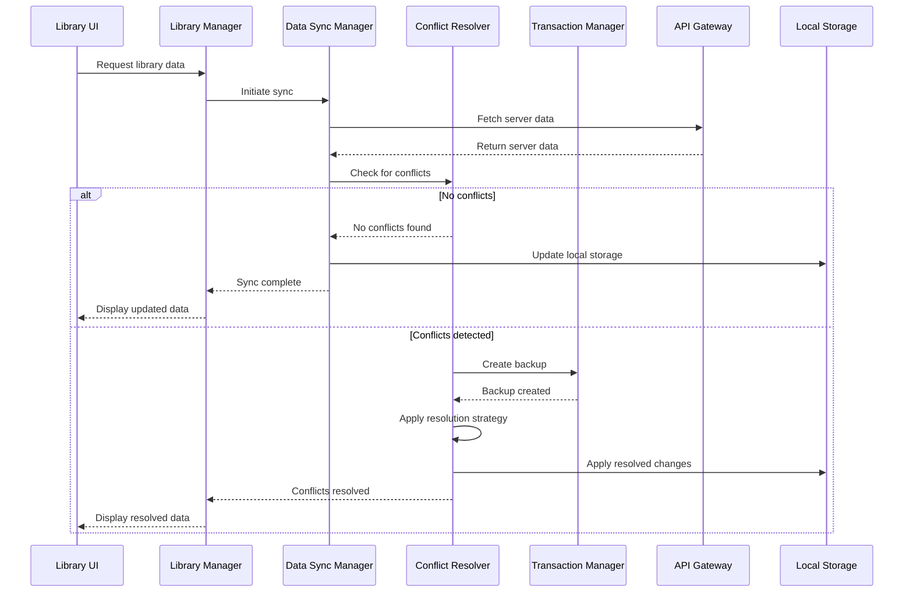

# Design Document: Library Data Persistence

## Overview

This design addresses critical data persistence bugs in the music library system where songs disappear during playback operations. The solution implements a robust data synchronization architecture using optimistic locking, event-driven updates, and conflict resolution strategies to ensure data consistency between local storage and server state.

The core approach separates concerns between data management, playback operations, and synchronization processes while providing atomic operations with rollback capabilities. This prevents race conditions, eliminates table naming inconsistencies, and protects active playback sessions from data management interference.

## Architecture

### High-Level Architecture



### Component Interaction Flow



## Components and Interfaces

### Library Manager

The central orchestrator that coordinates all library operations while maintaining data consistency.

**Interface:**
```typescript
interface LibraryManager {
  // Core operations
  getLibraryData(): Promise<LibraryData>
  syncWithServer(): Promise<SyncResult>
  addToFavorites(songId: string): Promise<OperationResult>
  removeFromFavorites(songId: string): Promise<OperationResult>
  
  // Playback integration
  notifyPlaybackStart(songId: string): void
  notifyPlaybackEnd(songId: string): void
  addToRecentlyPlayed(songId: string): Promise<void>
  
  // Protection mechanisms
  protectSong(songId: string, reason: ProtectionReason): void
  unprotectSong(songId: string): void
  isProtected(songId: string): boolean
}
```

**Key Responsibilities:**
- Coordinate all library data operations
- Maintain song protection during playback
- Ensure atomic operations through Transaction Manager
- Validate all data before processing
- Handle UI state updates consistently

### Data Sync Manager

Handles synchronization between local storage and server with race condition prevention.

**Interface:**
```typescript
interface DataSyncManager {
  sync(): Promise<SyncResult>
  validateServerResponse(data: any): ValidationResult
  handleEmptyResponse(): void
  retryWithBackoff(operation: () => Promise<any>): Promise<any>
  
  // Concurrency control
  acquireSyncLock(): Promise<boolean>
  releaseSyncLock(): void
  isSyncInProgress(): boolean
}
```

**Synchronization Strategy:**
- **Optimistic Locking**: Assumes conflicts are rare, validates before commit
- **Empty Response Validation**: Rejects empty server responses that could overwrite valid local data
- **Exponential Backoff**: Implements retry logic for network failures
- **Sync Lock**: Prevents concurrent sync operations using a mutex pattern

### Conflict Resolver

Implements intelligent conflict resolution strategies for server/local data mismatches.

**Interface:**
```typescript
interface ConflictResolver {
  detectConflicts(local: LibraryData, server: LibraryData): ConflictSet
  resolveConflicts(conflicts: ConflictSet): ResolutionPlan
  applyResolution(plan: ResolutionPlan): Promise<void>
  
  // Resolution strategies
  lastModifiedWins(conflict: DataConflict): Resolution
  userChoice(conflict: DataConflict): Promise<Resolution>
  mergeNonDestructive(conflict: DataConflict): Resolution
}
```

**Resolution Strategies:**
1. **Last-Modified-Wins**: For timestamp-based conflicts during normal operations
2. **Playback-Priority**: During active playback, prioritize maintaining playback continuity
3. **User-Choice**: For complex conflicts that require user decision
4. **Merge-Strategy**: For non-destructive conflicts (e.g., adding to both local and server)

### Transaction Manager

Provides atomic operations with rollback capabilities for all data modifications.

**Interface:**
```typescript
interface TransactionManager {
  beginTransaction(): TransactionId
  createBackup(data: any): BackupId
  commit(transactionId: TransactionId): Promise<void>
  rollback(transactionId: TransactionId): Promise<void>
  
  // Backup management
  restoreFromBackup(backupId: BackupId): Promise<void>
  cleanupOldBackups(): void
}
```

**Transaction Patterns:**
- **Backup-Before-Modify**: Create backup before any destructive operation
- **Two-Phase-Commit**: Validate server operation before local commit
- **Rollback-Window**: Maintain rollback capability for configurable time period
- **Cleanup-Strategy**: Automatic cleanup of old backups to prevent storage bloat

### API Gateway

Unified interface for all server communications, eliminating endpoint fragmentation.

**Interface:**
```typescript
interface APIGateway {
  // Unified library operations
  getFavorites(): Promise<Song[]>
  addFavorite(songId: string): Promise<OperationResult>
  removeFavorite(songId: string): Promise<OperationResult>
  getRecentlyPlayed(): Promise<Song[]>
  addToRecentlyPlayed(songId: string): Promise<OperationResult>
  
  // Legacy endpoint handling
  mapLegacyEndpoint(endpoint: string): string
  normalizeResponse(response: any): LibraryData
}
```

**Endpoint Consolidation:**
- **Primary Endpoints**: Single source of truth for each data type
- **Legacy Mapping**: Transparent routing of old endpoint calls to new endpoints
- **Response Normalization**: Consistent data format regardless of source endpoint
- **Version Handling**: Backward compatibility for API version differences

### Playback Session Protector

Prevents data operations on songs during active playback to avoid interruption.

**Interface:**
```typescript
interface PlaybackSessionProtector {
  protectSong(songId: string, sessionId: string): void
  unprotectSong(songId: string, sessionId: string): void
  isProtected(songId: string): boolean
  getProtectedSongs(): string[]
  
  // Queue management for deferred operations
  queueOperation(songId: string, operation: DeferredOperation): void
  executeQueuedOperations(songId: string): Promise<void>
}
```

**Protection Mechanisms:**
- **Session-Based Protection**: Tie protection to specific playback sessions
- **Operation Queuing**: Queue operations on protected songs for later execution
- **Automatic Cleanup**: Remove protection when playback ends
- **Emergency Override**: Allow critical operations with user confirmation

## Data Models

### Core Data Structures

```typescript
// Standardized song data structure
interface Song {
  id: string
  title: string
  artist: string
  album?: string
  duration: number
  url: string
  metadata: SongMetadata
  
  // Sync metadata
  lastModified: timestamp
  version: number
  source: 'local' | 'server' | 'merged'
}

// Library state with sync information
interface LibraryData {
  favorites: Song[]
  recentlyPlayed: Song[]
  playlists: Playlist[]
  
  // Sync metadata
  lastSyncTime: timestamp
  syncVersion: number
  conflicts: ConflictInfo[]
}

// Transaction and backup tracking
interface TransactionContext {
  id: string
  type: 'add' | 'remove' | 'update' | 'sync'
  targetSongs: string[]
  backup: BackupData
  timestamp: timestamp
  status: 'pending' | 'committed' | 'rolled_back'
}
```

### Database Schema Standardization

**Unified Table Structure:**
```sql
-- Single standardized favorites table
CREATE TABLE favorites (
  id VARCHAR(255) PRIMARY KEY,
  user_id VARCHAR(255) NOT NULL,
  song_id VARCHAR(255) NOT NULL,
  added_at TIMESTAMP DEFAULT CURRENT_TIMESTAMP,
  last_modified TIMESTAMP DEFAULT CURRENT_TIMESTAMP ON UPDATE CURRENT_TIMESTAMP,
  version INTEGER DEFAULT 1,
  sync_status ENUM('synced', 'pending', 'conflict') DEFAULT 'pending',
  
  UNIQUE KEY unique_user_song (user_id, song_id),
  INDEX idx_user_modified (user_id, last_modified),
  INDEX idx_sync_status (sync_status)
);

-- Recently played with automatic cleanup
CREATE TABLE recently_played (
  id VARCHAR(255) PRIMARY KEY,
  user_id VARCHAR(255) NOT NULL,
  song_id VARCHAR(255) NOT NULL,
  played_at TIMESTAMP DEFAULT CURRENT_TIMESTAMP,
  session_id VARCHAR(255),
  
  INDEX idx_user_played (user_id, played_at),
  INDEX idx_cleanup (played_at)
);
```

**Migration Strategy:**
- **Dual-Write Period**: Write to both old and new tables during transition
- **Data Validation**: Verify data consistency between old and new schemas
- **Gradual Cutover**: Switch reads to new table after validation
- **Legacy Cleanup**: Remove old tables after successful migration

## Error Handling

### Error Classification and Response

```typescript
enum ErrorType {
  NETWORK_ERROR = 'network_error',
  SYNC_CONFLICT = 'sync_conflict',
  DATA_CORRUPTION = 'data_corruption',
  PLAYBACK_PROTECTION = 'playback_protection',
  TRANSACTION_FAILURE = 'transaction_failure'
}

interface ErrorHandler {
  handleError(error: LibraryError): Promise<ErrorResolution>
  canRecover(error: LibraryError): boolean
  getRecoveryStrategy(error: LibraryError): RecoveryStrategy
}
```

**Error Recovery Strategies:**

1. **Network Errors**:
   - Exponential backoff retry (1s, 2s, 4s, 8s, max 30s)
   - Maintain local state during outages
   - Queue operations for retry when connection restored

2. **Sync Conflicts**:
   - Automatic resolution for simple conflicts
   - User notification for complex conflicts
   - Maintain conflict log for debugging

3. **Data Corruption**:
   - Validate checksums on critical data
   - Attempt automatic repair from backups
   - Request fresh data from server if repair fails

4. **Playback Protection Violations**:
   - Queue operations for post-playback execution
   - Notify user of deferred operations
   - Provide emergency override with confirmation

5. **Transaction Failures**:
   - Automatic rollback to previous state
   - Restore from backup if rollback fails
   - Log failure details for debugging

### Safe Mode Operation

When critical errors occur, the system enters safe mode:
- **Read-Only Operations**: Prevent further data corruption
- **Local Data Preservation**: Maintain all local data
- **User Notification**: Clear error messages with recovery options
- **Diagnostic Collection**: Gather information for debugging
- **Manual Recovery**: Provide tools for manual data recovery

## Testing Strategy

### Dual Testing Approach

The testing strategy combines unit tests for specific scenarios with property-based tests for comprehensive validation of universal correctness properties.

**Unit Testing Focus:**
- Specific error conditions and edge cases
- Integration points between components
- Mock server responses and network failures
- Database migration scenarios
- User interaction flows

**Property-Based Testing Focus:**
- Universal properties that must hold across all inputs
- Data consistency invariants
- Conflict resolution correctness
- Transaction atomicity guarantees
- Sync operation properties

**Testing Configuration:**
- Property tests: Minimum 100 iterations per test
- Each property test tagged with: **Feature: library-data-persistence, Property {number}: {description}**
- Use appropriate PBT library for chosen implementation language
- Comprehensive input generation for realistic test scenarios

**Test Environment Setup:**
- Mock server with configurable responses
- Simulated network conditions (delays, failures, partial responses)
- Concurrent operation testing
- Database state manipulation for conflict scenarios
- Playback session simulation

## Correctness Properties

*A property is a characteristic or behavior that should hold true across all valid executions of a system—essentially, a formal statement about what the system should do. Properties serve as the bridge between human-readable specifications and machine-verifiable correctness guarantees.*

Based on the prework analysis and property reflection to eliminate redundancy, the following properties ensure the correctness of the library data persistence system:

### Property 1: Empty Server Response Protection
*For any* sync operation that receives empty server data, the local library data should remain unchanged and the sync should be marked as failed
**Validates: Requirements 1.1**

### Property 2: Sync Operation Mutual Exclusion  
*For any* concurrent sync operations attempted on the same library, only one should proceed while others wait for completion
**Validates: Requirements 1.2, 4.4**

### Property 3: Data Validation Before Processing
*For any* incoming data (server responses, user inputs, API calls), the system should validate against expected schema and reject invalid data while preserving current state
**Validates: Requirements 1.5, 7.1, 7.2**

### Property 4: Network Failure State Preservation
*For any* network failure during sync operations, the local library state should remain unchanged and retry should follow exponential backoff pattern
**Validates: Requirements 1.4, 9.1**

### Property 5: Conflict Resolution Application
*For any* detected conflict between server and local data, a resolution strategy should be applied before any data updates occur
**Validates: Requirements 1.3, 6.1, 6.4, 6.5**

### Property 6: Database Table Name Consistency
*For any* database operation in the system, only the standardized 'favorites' table name should be used
**Validates: Requirements 2.1, 2.4**

### Property 7: Schema Migration Data Integrity
*For any* data migration between old and new table schemas, all existing data should be preserved and accessible in the new format
**Validates: Requirements 2.2, 2.5**

### Property 8: Player Component Data Isolation
*For any* playback operation or player state change, the library data should remain completely unmodified
**Validates: Requirements 3.1, 3.2, 3.3, 3.5**

### Property 9: Library Data Availability Independence
*For any* player component state or error condition, all library songs should remain available and accessible
**Validates: Requirements 3.4**

### Property 10: Transaction Backup and Rollback
*For any* destructive operation (deletion, modification), a backup should be created before execution and rollback should be available within the configured time window
**Validates: Requirements 4.1, 4.3, 4.5, 9.4**

### Property 11: Two-Phase Deletion Consistency
*For any* song deletion request, local removal should only occur after successful server deletion confirmation
**Validates: Requirements 4.2**

### Property 12: API Gateway Unification
*For any* library data operation, all requests should be routed through the unified API Gateway interface with consistent response normalization
**Validates: Requirements 5.1, 5.2, 5.4, 5.5**

### Property 13: API Version Compatibility
*For any* API version or endpoint format, the system should handle it transparently without affecting library functionality
**Validates: Requirements 5.3**

### Property 14: Conflict Logging and User Notification
*For any* data conflict that cannot be automatically resolved, the conflict should be logged and user options should be presented
**Validates: Requirements 6.2, 6.3**

### Property 15: Data Corruption Detection and Recovery
*For any* data integrity violation detected through checksums, the system should attempt automatic repair or request fresh data
**Validates: Requirements 7.3, 7.4, 7.5**

### Property 16: Playback Session Protection
*For any* song in an active playback session, it should be marked as protected and all modification operations should be deferred until playback completion
**Validates: Requirements 8.1, 8.2, 8.3**

### Property 17: Playback Safety Notification
*For any* song that becomes safe to modify after playback, the player should notify the library system and queued operations should execute
**Validates: Requirements 8.4**

### Property 18: Emergency Operation Override
*For any* emergency operation on protected songs, playback should pause, operation should execute, and playback should resume
**Validates: Requirements 8.5**

### Property 19: Operation Logging Completeness
*For any* library operation (sync, add, delete, conflict resolution), complete details should be logged for debugging and recovery
**Validates: Requirements 9.2**

### Property 20: Safe Mode Data Preservation
*For any* critical error condition, the system should enter safe mode while preserving all local library data
**Validates: Requirements 9.3**

### Property 21: Unrecoverable Error User Notification
*For any* error condition where recovery is impossible, specific error details and suggested actions should be provided to the user
**Validates: Requirements 9.5**

### Property 22: Automatic Playback History Tracking
*For any* song skip or playback transition, the previous song should be automatically added to recently played list without interfering with current playback
**Validates: Requirements 10.1, 10.2**

### Property 23: History Persistence During Sync
*For any* playback history operation, it should complete successfully even during concurrent sync operations without causing conflicts
**Validates: Requirements 10.3, 10.4, 10.5**

### Property 24: Incremental Sync Efficiency
*For any* sync operation, only modified data should be transferred, not the complete dataset
**Validates: Requirements 11.3**